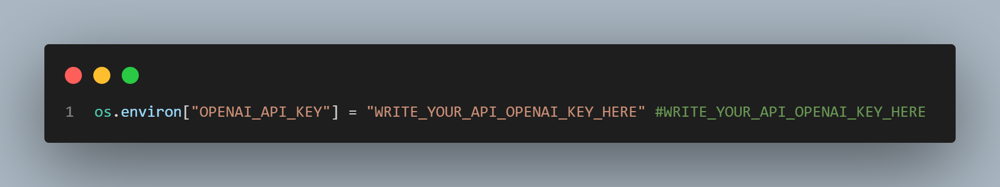

# Programming Language Translator

Programming language translator using the "OpenIA" api translate the current programming language to the programming language that is required, this facilitates the understanding of the programming language and its operation in different ways.

1. Write your openai key 

2. Enter the current programming language to be translated, for example in this case we want to translate a code from python to javascript so we enter python as current programming language 

3. Enter the code

4. Enter the target programming language and click on the "translate" button.

5. The translated programming language is displayed and you can copy everything with the "Copy" button..

Made by : Diego Ivan Perea Montealegre

